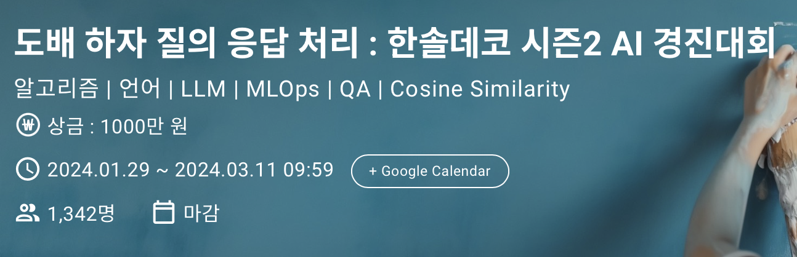
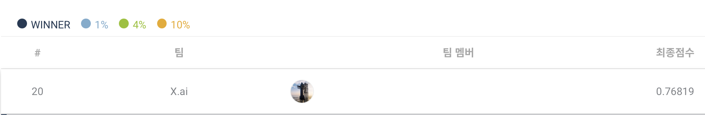
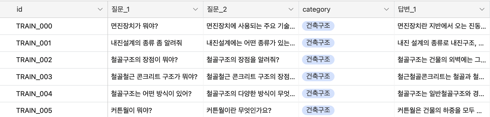

# 🚧Hansol_llm_fine-tuning
도배 하자 질의 응답 처리 : 한솔데코 시즌2 AI 경진대회
  
- 대회 바로가기 이미지 클릭
- 이번 시즌 2에서는 한 걸음 더 나아가, NLP(자연어 처리) 기반의 QA (질문-응답) 시스템을 통해 도배하자와 관련된 깊이 있는 질의응답 처리 능력을 갖춘 AI 모델 개발에 도전합니다.
## Private 순위  

## Member   
### 
  **최승혁**  
  [Dacon](https://dacon.io/myprofile/472402/home)  
  [Github](https://github.com/ColdTbrew)  
  [Hugging-Face](Coldbrew9/Fine-tuning-gemma-singleQ)  
  
----------------------------------------------------------

# Table of Contents

1. [Introduction](#🚧Hansol_llm_fine-tuning)
2. [Private 순위](#private-순위)
3. [Member](#member)
4. [데이터](#데이터)
   - [train.csv](#train.csv)
   - [test.csv](#test.csv)
   - [sample_submission.csv](#sample_submission.csv)
5. [평가 산식](#평가-산식)
6. [접근 방식](#접근-방식)
   - [파인튜닝 시도](#1-파인튜닝-시도)
   - [RAG(Retrieval-Augmented Generation) 방식 추가 시도](#2-ragretrieval-augmented-generation-방식-추가-시도)
   - [Gemma 모델 시도](#3-gemma-모델-시도)
   - [학습 데이터셋 구조 조정](#4-학습-데이터셋-구조-조정)
   - [하이퍼파라미터 설정 및 특징](#하이퍼파라미터-설정-및-특징)
7. [Wandb](#wandb)
8. [Special Thanks to](#special-thanks-to)

----------------------------------------------------------

## 데이터  
  
### train.csv
    id : 질문 - 답변 (QA) 샘플 고유 번호  
    질문_1, 질문_2 : 샘플 별 동일한 내용으로 구성된 질문 2개  
    category : 질문 - 답변 (QA) 샘플의 도메인 세부 분야  
    답변_1, 답변_2, 답변_3, 답변_4, 답변_5 : 샘플 별 질문에 대한 동일한 답변 Reference 5개  

### test.csv
    id : 평가 질문 샘플 고유 번호
    질문 : 평가 샘플의 질의 내용

### sample_submission.csv 
    id : 평가 질문 샘플 고유 번호  
    vec_0, vec_1 ... vec_511 : 생성된 답변을 512 차원의 Embedding Vector로 표현된 결과  

## 평가 산식
    평가 산식 : Cosine Similarity (코사인 유사도)
    Public score : 전체 테스트 데이터 중 사전 샘플링된 40%
    Private score : 전체 테스트 데이터 100%

    
----------------------------------------------------------

## 접근 방식

### 1. 파인튜닝 시도

- **Ko-llm-leaderboard 상의 모델 비교**
  - 첫 시도로 [Ko-llm-leaderboard](https://huggingface.co/spaces/upstage/open-ko-llm-leaderboard) 상의 1위 모델인 `ldcc`를 파인튜닝하려 했으나, `tokenizer` 조절에 어려움이 있었습니다.
  - 이후 2위 모델인 `Edentns/DataVortexS-10.7B-dpo-v1.11`로 방향을 전환하여 시도해 보았습니다.

### 2. RAG(Retrieval-Augmented Generation) 방식 추가 시도

- 다양한 문제에 대응하기 위해 RAG 방식을 추가로 시도하였습니다.

### 3. Gemma 모델 시도

- 최신 출시된 `Gemma` 모델을 이용한 실험도 진행하였습니다.

### 4. 학습 데이터셋 구조 조정

- 기존 학습 데이터셋은 한 질문에 한 답만 포함되어 있었습니다. 
- 테스트셋은 두 질문을 한 번에 물어보고, 두 질문에 대한 두 개의 답을 생성해야 하는 구조였습니다.
- 이에 따라, 학습셋에서 임의로 문제를 두 개씩 합쳐서 학습을 진행하였습니다.

### 하이퍼파라미터 설정 및 특징

메모리 효율을 높이기 위해 `lora rank = 8`을 사용했습니다. 각 하이퍼파라미터의 선택이 학습 과정과 모델 성능에 미치는 영향을 간결하게 설명합니다.

- **per_device_train_batch_size=2**: 메모리 사용 최소화를 위해 디바이스 당 배치 크기 2를 사용.
- **gradient_accumulation_steps=4**: 더 큰 배치 사이즈의 이점을 얻기 위해 그래디언트 누적 스텝 4 설정.
- **warmup_ratio=0.03**: 전체 학습 스텝의 3% 동안 학습률을 점진적으로 증가시킴.
- **num_train_epochs=10**: 총 10 에폭 동안 모델 학습.
- **learning_rate=2e-4**: 학습률을 0.0002로 설정하여 안정적인 수렴을 도모.
- **fp16=True**: 16비트 부동 소수점을 사용하여 계산 효율성 및 메모리 사용 최소화.
- **logging_steps=1**: 모든 스텝마다 로깅을 수행하여 학습 과정 모니터링.
- **optim="paged_adamw_8bit"**: 메모리 사용을 줄이기 위해 8비트 최적화된 AdamW 사용.
- **report_to="wandb"**: 학습 과정과 결과를 Weights & Biases에 기록.

## Wandb
- Gemma training  
  https://wandb.ai/x_team/Fine%20tuning%20gemma%20singleQ/reports/Hansol-llm-fine-tuning-with-Gemma--Vmlldzo3MzI4MDg3

### Special Thanks to  
[정봉기](https://github.com/JB0527)
[정준한](https://github.com/hyjk826)
